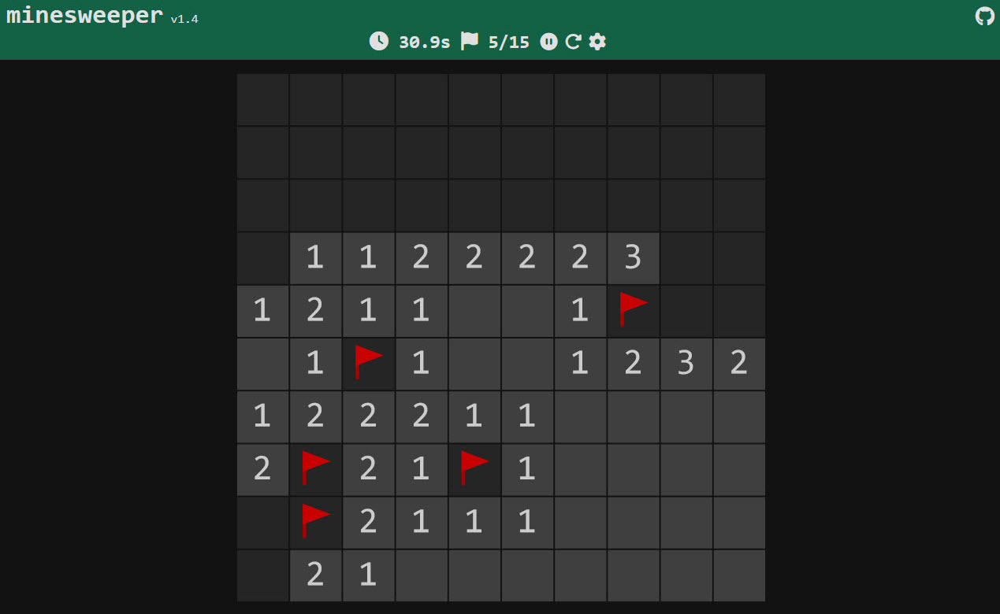

# Welcome!
Welcome to this minesweeper game. Customize the game to your preferences in the settings page. Remember to save settings by pressing the icon on the right on text input settings. Future releases will add more customizable options. Not all maps are solvable and sometimes **you must guess**.

## How to play?
Press anywhere to begin. Numbers indicate the number of mines adjacent (including corners) to the square.  Empty squares indicate no mines adjacent to it. Left click/tap to open squares. Right click/hold tap to flag squares that you believe have mines. Open a square with a mine and game over! Flag all squares with mines to win!

Supports chording (revealing all 8 adjacent squares when the number of adjacent mines equals the number of adjacent flags) by simultaneously right and left clicking or by clicking using the midde mouse button. Chording can be done by tapping normally on an exposed tile on mobile.
[https://nicholachen.github.io/minesweeper/](https://nicholachen.github.io/minesweeper/)

## Settings
### Gameplay
 - `Difficulty` - Selects difficulty of map `Beginner/Intermediate/Expert/Custom` `Default: Beginner`
    - `Beginner` - 9x9, 10 mines
    - `Intermediate` - 16x16, 40 mines
    - `Expert` - 30x16, 99 mines
    - `Custom`
        - `Map size` - Size of map (width x height). `5x5-99x99` `Default: 10x10`
        - `Number of mines` - Number of mines in map. `1-50% of squares in map (max 1000)` `Default: 15`
 - `Infinite lives` - Makes opening mines not end game. `Off/On` `Default: Off`
 - `Mine randomness` - Changes how random the mines are generated. `No guess/Easy/Normal` `Default: Normal`
    - `No guess` - Mines are generated such that the game can be solved without guessing.
    - `Easy` - Mines can be placed anywhere except the first opened square and its adjacent squares.
    - `Normal` - Mines can be placed anywhere except the first opened square.
### Controls
 - `Register clicks` - Selects if mouse clicks are registered when the mouse button is released up or as soon as the mouse button is pressed down. `On mouse up/On mouse down` `Default: On mouse down`
 - `Chording` - Select if chording is enabled. Info about chording in **How to play?** `Off/On` `Default: On`
 - `Pause/unpause shortcut` - Selects keyboard shortcut to pause and unpause game. `Default: SPACE`
 - `Restart shortcut` - Selects keyboard shortcut to restart game. `Default: ESC`
 - `Pan and zoom shortcut` - Selects keybaord shortcut to toggle pan and zoo mode. `Default: Z`
 - `Stats shortcut` - Selects keybaord shortcut open and close the stats page. `Default: A`
 - `Settings shortcut` - Selects keybaord shortcut open and close the settings page. `Default: S`
 - `Mobile hold duration to flag` - Minimum time in ms needed to tap and hold on mobile in order to flag a square. `>=50` `Default: 250`
 - `Mobile easy pan/zoom` - Pan and zoom on mobile without the need to turn on pan and zoom mode. `Off/On` `Default: Off`
### Appearance
 - `Show timer` - Selects if the timer should be displayed in the header. `Off/On` `Default: On`
 - `Show number of flags` - Selects if the flag counter should be displayed in the header. `Off/On` `Default: On`
 - `Show pause/unpause button` - Selects if the pause/unpause button should be displayed in the header. Keyboard shortcut will still work if off. `Off/On` `Default: On`
 - `Show restart button` - Selects if the restart button should be displayed in the header. Keyboard shortcut will still work if off. `Off/On` `Default: On`
 - `Theme` - Select to use a preset theme or use a custom theme. `Preset/Custom` `Default: Preset` 
    - `Preset` - Select from the list of preset themes. `Default: Default Dark`
    - `Custom` - Type the hex color codes for each of the customizable options.
        - `Share theme` - Creates and copies a shareable link with the current custom theme.
### Advanced
 - `Show 3BV/sec on win screen` - Shows your 3BV/sec stat after winning a game. `Off/On` `Default: Off`
 - `Show all mines` - Shows the location of all mines. `Off/On` `Default: Off`
 - `Analysis` - Analyzes the probability of mines at a square. Advanced is more computationally intensive. `Off/Simple/Advanced` `Default: Off`
 - `Map creator`- Mode that allows the ability to create custom maps. Placing flags now places mines. `Off/On` `Default: Off`
 - `Reset settings` - Resets **ALL** settings. Doesn't reset Stats.